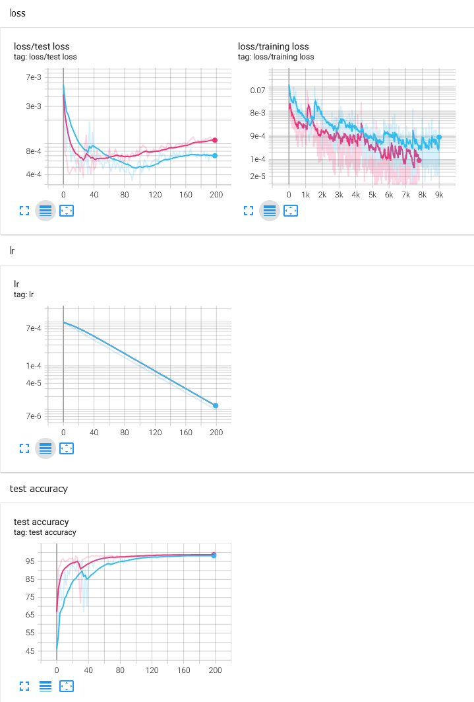
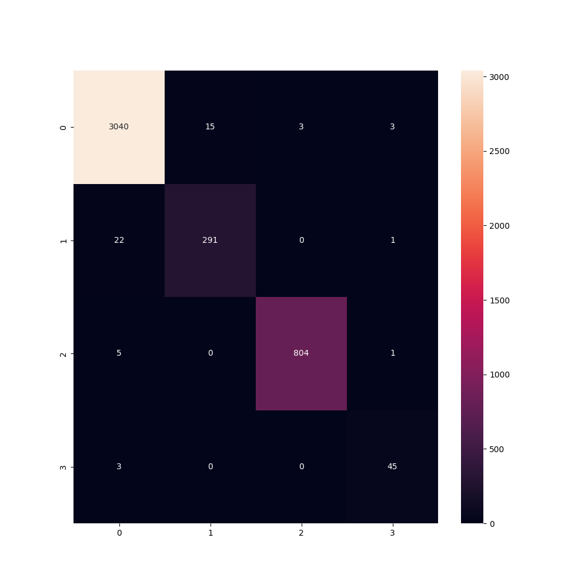

# LOL-Swarm-Tentacle-Recall-Bug-Trigger 

## 数据准备

1. 录像 <kbd>Win</kbd> + <kbd>G</kbd>
2. 获取中央图像, 导出单张图片 `check_video.py`
3. 标注 `labeling.py`

TODO: 

- [ ] 收集其他地图数据

## 模型准备

1. 训练 `train.py`，大致训练 400 轮就够了，没有任何花哨的技巧
2. 清洗数据, 重标注漏标、错标 `dataset-clean.py`
3. 再训练直到效果良好
4. 导出为 onnx `onnx-export.py`

pth 和 onnx 权重我已经上传到 [release](https://github.com/myuanz/LOL-Swarm-Tentacle-Recall-Bug-Trigger/releases)

TODO:

5. [ ] 量化、剪枝

## 实战

`snapshot.py`

1. 循环截屏记录当前状态
2. 根据最近两次捶地预测下次捶地, 遇到卡片时延时
3. 在捶地前发出 beep

TODO: 

- [ ] 修理卡片延时 bug
- [ ] 上传录像

## 被放弃的想法

- 使用 umap 降维图像, 也许跳起捶地的图像就在一簇, 这样可以无人工获取到一些初步的标签. 放弃原因: `效果不佳`
- 将连续 n 帧一起输入网络, 以便让网络根据上下文确定帧状态. 放弃原因: `resnet18 效果已经非常好, 上下文实现复杂`
  - 将连续几帧分别输入编码器, 获取其嵌入, 然后每次再通过另一个分类器吃下几个嵌入. 如此运算量没有相对单张涨至n倍
  - 使用 LSTM 构建简单的时序网络, 以便在运算量不增加很多的前提下拥有上下文
- 使用更小的骨干网络, 比如 pplcnet. 放弃原因: `模型小但推理速度与 resnet18 相近, 且准确率不佳`

